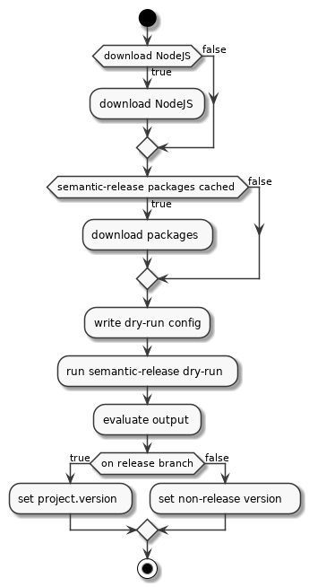

# Gradle semantic-release

Execute [Semantic Release][semrel] inside your Gradle build using `npx`. Also allows you to download a nodejs dist for your build on demand.

## How does it work

The plugin executes `semantic-release` in `dry-run` mode on Gradle project configuration phase. It extracts the detected version and writes it to `project.version`.

> 

## Usage

Configure semantic-release using a `.releaserc.yml` in your `rootProject`

### .releaserc.yml

### Improve Performance

* Use a local NodeJS installation
* Preinstall required packages using `npm -g`

[semrel]: https://github.com/semantic-release/semantic-release