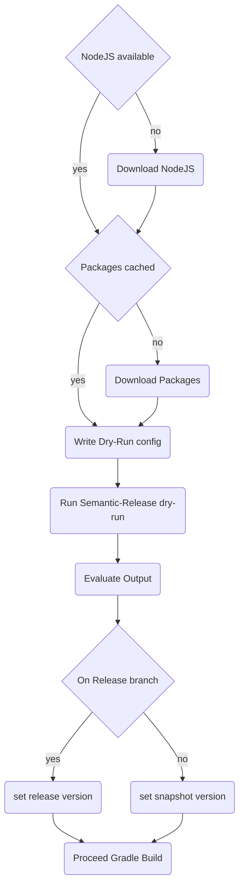

```mermaid
graph TD
  q_download{NodeJS available}
  download(Download NodeJS)
  
	q_cache{Packages cached}
  cache(Download Packages)
  
  config(Write Dry-Run config) --> run_sr(Run Semantic-Release dry-run)
  run_sr --> eval(Evaluate Output)

  q_branch{On Release branch}
  release(set release version)
  snapshot(set snapshot version)

  perform(Proceed Gradle Build)

  q_download --> |yes| q_cache
  q_download --> |no| download
  download --> q_cache
  
  q_cache --> |yes| config
  q_cache --> |no| cache
  cache --> config

  eval --> q_branch
  q_branch --> |yes| release
  q_branch --> |no| snapshot

  release --> perform
  snapshot --> perform
```